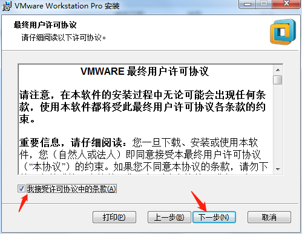
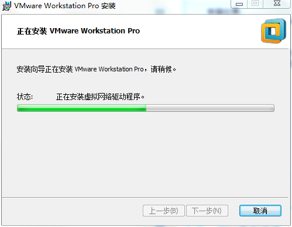

## 1. 安装vmware





点击【下一步】，然后【安装】




输入许可证密匙：

```
5A02H-AU243-TZJ49-GTC7K-3C61N
```

点击【输入】则完成安装

## 2. 在VMware下安装虚拟Linux系统

### 2.1. 虚拟机的配置


选择默认配置类型【典型】，然后点击【下一步】


选择之前已经下载好的Linux系统的ios文件，然后点击【下一步】


设置虚拟机的名称和虚拟机的安装位置（注意：请保证路径中没有中文），然后点击【下一步】

再点击【下一步】，再点击【完成】，开始进入虚拟机的安装

### 2.2. 安装虚拟机
